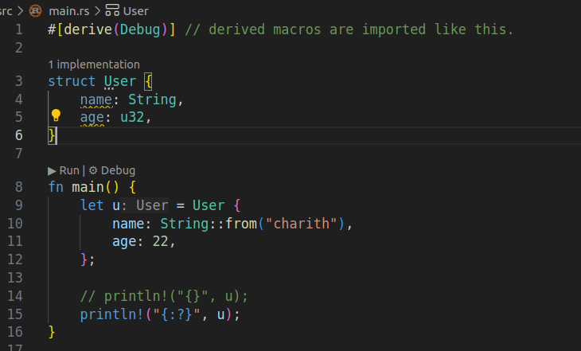

# Rust Meta Programming


**Meta Programming**: *Writing code that writes more code* through expansion of macros used in the code at compile time.

> use ```cargo expand``` from cargo-expand package to view the code after macro expansion.


In Rust, ```macros``` are used when you need to work with the structure of code itself (like handling arbitrary syntax or generating repetitive code), which functions and traits cannot express.

And When inputs are really vague and unpredictable with multiple no.of arguments or types of arguments. In that case its suitable to use a macro instead of a function.

```println!()``` is a ````Declarative Macro````, inside which there are multiple branches of code, from which one would replace the macro (during macro expansion) based on the input arguments.

## Traits

Traits are similar to interfaces in Java/JS. They let you define the ```shape```/```interface``` of what you're building.

> When a struct implements a trait, it must provide implementations for all required items of the trait. If the trait defines defaults for some methods, those don’t need to be reimplemented unless you want to override them.


### Why use traits?

While trying to print a struct:


To solve this, the ```Display``` trait needs to be manually implemented in order to print the values of the struct in specific format by passing a formatter in the function inside the display trait.


Hence, implementing the Display trait like this would enable the struct to be printed.

But, Implementing ```Traits``` like this inside the source code would make it verbose with too much boilerplate code. So its better to have a default implementation in these cases, in the form of ```Custom Derive Procedural Macros```.
**Such that just by using the macro, the required code to implement the trait would be automatically expanded during compilation by default.**

Two ways to print a variable in rust:

```rust
println!("{}", u); // displaying the variable --> goes to Display trait
println!("{:?}", u); // debugging the variable --> goes to Debug trait
```


There is a inbuilt ```Debug``` macro, hence it can be directly used to print the struct in this case, instead of custom implementation of the ```Debug trait```.




> The ```Custom Derive Procedural Macros``` always exist as a pair with a ```Trait```, such that it implements the corresponding trait.

There is no default derived macro for ```Display``` trait unlike the ```Debug``` trait, hence it was needed to be custom implementation.

(Since **Debug** is for developers to just dump the struct and debug. Whereas **Display** is for end users which is meant to be human readable and have a polished representation.)

> What are Attribute Procedural Macros?

## Macros
